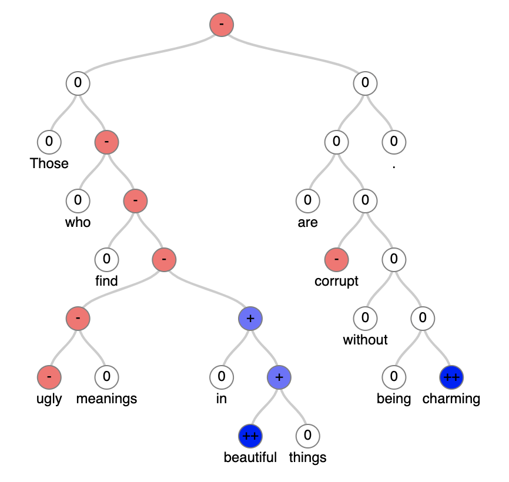

# CoreNLP sentiment tree parser

This tool can parse CoreNLP `sentimentTree` property.

## Installation

pip install -r requirements.txt

## Usage

### Parsing sentimentTree

```python
import json
import corenlp_sentiment_tree_parser
from pycorenlp import StanfordCoreNLP

# get the sentimentTree for a text
corenlp = StanfordCoreNLP('http://localhost:9000')
text = 'Those who find ugly meanings in beautiful things are corrupt without being charming.'
res = corenlp.annotate(text,
                       properties={'annotators': 'sentiment',
                                   'outputFormat': 'json',
                                   'timeout': 50000,
                       })
# ensure that the response is parsed
res_json = json.loads(res)


# select the first sentence
sentence = res_json['sentences'][0]

# select the sentimentTree
sentiment_tree_string = sentence['sentimentTree']

# or if you have the sentimentTree already
sentiment_tree_string = """
(ROOT|sentiment=1|prob=0.520
  (NP|sentiment=2|prob=0.671 (NP|sentiment=2|prob=0.995 Those)
    (SBAR|sentiment=1|prob=0.698 (WHNP|sentiment=2|prob=0.994 who)
      (S|sentiment=1|prob=0.692 (VBP|sentiment=2|prob=0.995 find)
        (NP|sentiment=1|prob=0.648
          (NP|sentiment=1|prob=0.736 (JJ|sentiment=1|prob=0.864 ugly) (NNS|sentiment=2|prob=0.631 meanings))
          (PP|sentiment=3|prob=0.483 (IN|sentiment=2|prob=0.993 in)
            (NP|sentiment=3|prob=0.545 (JJ|sentiment=4|prob=0.914 beautiful) (NNS|sentiment=2|prob=0.992 things)))))))
  (@S|sentiment=2|prob=0.642
    (VP|sentiment=2|prob=0.701 (VBP|sentiment=2|prob=0.992 are)
      (ADJP|sentiment=2|prob=0.642 (JJ|sentiment=1|prob=0.426 corrupt)
        (PP|sentiment=2|prob=0.575 (IN|sentiment=2|prob=0.973 without)
          (S|sentiment=2|prob=0.483 (VBG|sentiment=2|prob=0.996 being) (ADJP|sentiment=4|prob=0.849 charming)))))
    (.|sentiment=2|prob=0.997 .)))"""

# parse the sentimentTree string
parsed = corenlp_sentiment_tree_parser.parse_sentiment_string(sentiment_tree_string)

# save it in a json file (see the file attached)
with open('output_example.json', 'w') as f:
    json.dump(parsed, f, indent=2)
```

### Visualise with d3.js

```python
# convert the data structure to d3
d3_tree = corenlp_sentiment_tree_parser.d3_visit_node(parsed)

# to visualise without a file server, it is necessary to load a js file which contains a variable with inside the tree data
tree_data_str = f'treeData = {json.dumps(d3_tree, indent=2)}'
# this file is saved
with open('tree_data_example.js', 'w') as f:
    f.write(tree_data_str)

# afterwards, you can open the file d3_example.html which loads the created .js file
```

This will generate the following image

